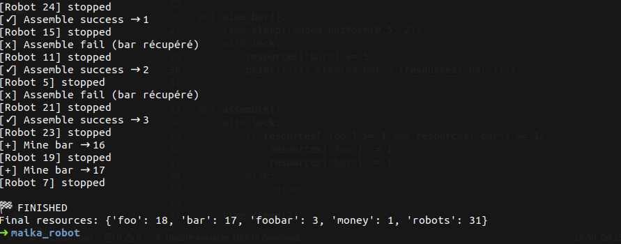

# 🏭 Factory Simulation — Foobar Production Line

> A multi-threaded simulation of an automated robot factory. The goal: scale from **2 robots** to **30 robots** through mining, assembly, selling, and buying.

---

## 📸 Screenshot



---

## 📌 Overview

This project simulates an automated production line controlled by independent robots running in parallel threads. Each robot makes its own decisions based on the current factory state.

**Starting conditions:**
- 🤖 2 robots
- 💰 0€, 0 resources

**Win condition:** Reach **30 robots**.

---

## 🚀 How to Run

```bash
python3 main.py
```

---

## 🧠 Resources

| Symbol | Name | Role |
|--------|------|------|
| 🪵 | `foo` | ..|
| 🔩 | `bar` | .. |
| 📦 | `foobar` | Final product |
| 💰 | `money` | Currency |
| 🤖 | `robots` | Factory workers |

---

## 🤖 Robot Actions

### ⛏️ Mining

| Action | Duration | Output |
|--------|----------|--------|
| `mine_foo` | 1s | +1 foo |
| `mine_bar` | 0.5–2s (random) | +1 bar |

### 🛠️ Assembly — `assemble_foobar`

- **Requires:** 1 foo + 1 bar
- **Duration:** 2s
- **Success rate:** 60%
- **On success:** +1 foobar
- **On failure:** bar recovered, foo lost

### 💰 Selling — `sell_foobar`

- **Sells:** up to 5 foobar at once
- **Duration:** 10s
- **Gain:** 1€ per foobar sold

### 🤖 Buying a Robot — `buy_robot`

- **Cost:** 3€ + 6 foo
- **Duration:** 1s
- **Effect:** dynamically spawns a new robot thread

### 🔄 Idle

- **Duration:** 5s (fallback when no action is possible)

---

## ⚙️ Architecture

```
main.py
├── Factory (shared state)
│   ├── foo, bar, foobar, money, robots (int)
│   └── Lock (threading.Lock)
└── Robot (Thread)
    ├── decide_action()  ← rule-based AI
    ├── mine_foo / mine_bar
    ├── assemble_foobar
    ├── sell_foobar
    └── buy_robot
```

- **Multi-threading** — each robot runs as an independent `Thread`
- **Global Lock** — protects shared resource state
- **Centralized logging** — real-time + full history

---

## 📜 Log Output Example

```
[Robot 2] → mine_foo
[💰] Sold 0 → money: 5€
[Robot 1] → mine_foo
[+] created foo → 1
[Robot 2] → mine_foo
[+] created foo → 2
[Robot 1] → mine_foo
...
[Robot 1] → buy_robot
[+] created foo → 1
[Robot 2] → assemble
[🤖] New robot created → total: 3
[Robot 3] stopped
[Robot 1] stopped
[✓] Assemble success → 1
[Robot 2] stopped

```

---

## ⚠️ Known Limitations

Due to multi-threaded execution

- The robot count may momentarily exceed 30 before all threads synchronize

---

## 📈 Possible Improvements
- [ ] Real-time visualization dashboard

---
 